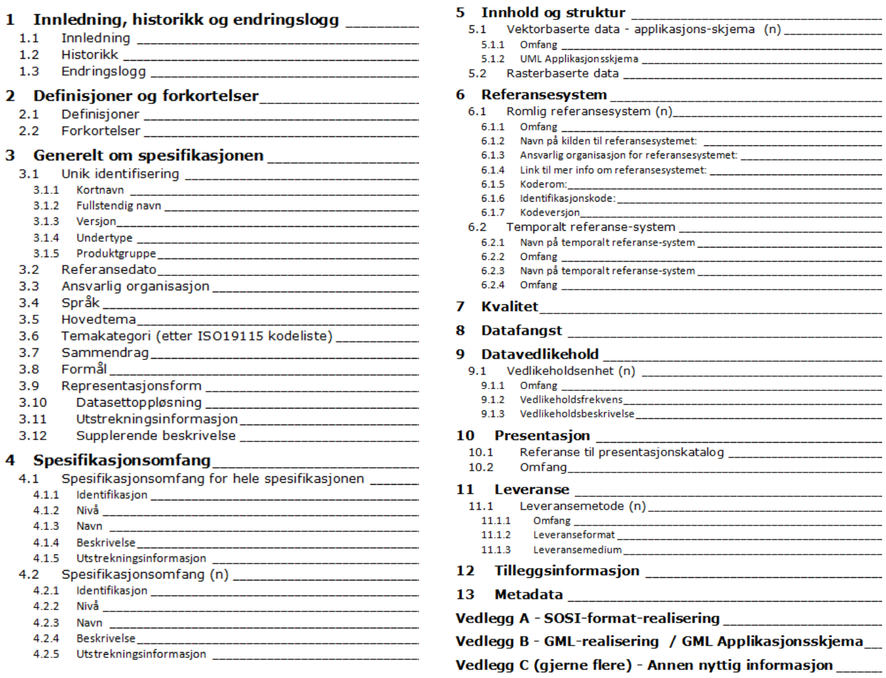

= Veileder for utarbeidelse av SOSI produktspesifikasjoner
:encoding: utf-8
:lang: nb
include::Språk-{lang}.adoc[]
:toc: left
:toclevels: 4
:sectnums:
:sectnumlevels: 4
:numbered:
:!chapter-signifier: 
:!example-caption:
:source-highlighter: rouge
:stem: latexmath
:eqnums:
:icons: font

:prodspekveileder: Veileder for utarbeidelse av SOSI produktspesifikasjoner
:utplukkveileder: link:https://sosi.geonorge.no/veiledere/Veileder_i_%c3%a5_modellere_produktspesifikasjon_som_utplukk_fra_SOSI_fagomr%c3%a5der.pdf[Veileder i å modellere SOSI produktspesifikasjon som utplukk fra SOSI fagområder^]
:installasjonsveileder: link:https://sosi.geonorge.no/veiledere/installasjonsveileder/index.html[Installasjon av programvare for arbeid med UML-modeller i SOSI-modellregister^]
:eksempeldokument: link:https://www.geonorge.no/globalassets/geonorge2/standardisering/dokumenter/Eksempel-pa-SOSI-produktspesifikasjonsdokument-august-2024.pdf[Eksempel på SOSI produktspesifikasjon^]
:prodspekmal: https://www.geonorge.no/globalassets/geonorge2/standardisering/maler/asciidocmaler.zip[Mal for SOSI-produktspesifikasjonsdokument]

:prodspekstandard: link:https://register.geonorge.no/sosi-standarden/sosi-produktspesifikasjoner-krav-og-godkjenning[SOSI produktspesifikasjoner - Krav og godkjenning^]
:prodspekstandardkort: link:https://register.geonorge.no/sosi-standarden/sosi-produktspesifikasjoner-krav-og-godkjenning[produktspesifikasjonsstandarden^]
:umlstandard: link:https://register.geonorge.no/standarder/sosi/del-1-generell-del/regler-for-uml-modellering[Regler for UML-modellering^]
:objektkatalog: link:https://register.geonorge.no/standarder/sosi/del-2-generell-objektkatalog[SOSI Del 2 - Generell objektkatalog^]
:geodatakvalitet: link:https://register.geonorge.no/standarder/sosi/standarder-geografisk-informasjon/geodatakvalitet[Geodatakvalitet^]
:rammeverk: link:https://register.geonorge.no/subregister/versjoner/nasjonalt-rammeverk-for-geografisk-informasjon/kartverket/rammeverksdokumentet/kartverket/teknologisk-rammeverk-for-den-geografiske-infrastrukturen[Teknologisk rammeverk for den geografiske infrastrukturen^]
:rammeverkkort: link:https://register.geonorge.no/subregister/versjoner/nasjonalt-rammeverk-for-geografisk-informasjon/kartverket/rammeverksdokumentet/kartverket/teknologisk-rammeverk-for-den-geografiske-infrastrukturen[rammeverksdokumentet^]
:veileder-forskrift: link:https://www.regjeringen.no/no/dokumenter/veiledning-til-forskrift-om-kart-stedfestet-informasjon-arealformal-og-digitalt-planregister/id2628439/[Veileder til forskrift om kart, stedfestet informasjon, arealformål og digitalt planregister^]

== Innledning

=== Hva er en produktspesifikasjon
En produktspesifikasjon er en detaljert beskrivelse av et datasett eller datasettserie (produktgruppe) med tilliggende informasjon som:

* vil gjøre det mulig å fremstille produktet
* gi brukere muligheten til å vurdere om et produkt er egnet til en tiltenkt bruk
* vil være nyttig for å kunne utnytte produktet på beste måte, og unngå feilbruk

Sagt på en annen måte er en produktspesifikasjon en beskrivelse av interesseområdet/fagområdet samt en framgangsmåte for hvordan dette interesseområdet skal representeres i et datasett. 

=== Hva produktspesifikasjoner skal brukes til
En produktspesifikasjon kan benyttes for produksjon, salg, sluttbruk av et produkt, samt for andre formål.

Mer detaljert kan den brukes til:

* Holde oversikt over datasett ved bestilling av data
* Den mest presise måten å fortelle hva som skal leveres
* Solid grunnlag for å kontrollere at leveransen er slik den skal være (SOSI-kontroll)
* Den beste måten å fortelle mottakere hva produktet er (sammen med metadata)
* Styre forventninger til produktet, slik at feilbruk reduseres
* Unngå erstatningskrav på grunnlag av feilbruk og eller feil forventninger
* Svært godt grunnlag for å sette opp tjenester som bruker dataene som inngår i et produkt, herunder Tjenesteorientert arkitektur og Modelldrevet arkitektur (MDA) 

=== SOSI produktspesifikasjon
En SOSI produktspesifikasjon er en produktspesifikasjon som er tilpasset SOSI-måten å spesifisere geodataprodukter. En SOSI produktspesifikasjon har også krav til godkjenning og tilgjengeliggjøring som forenkler arbeidet med datadeling i den norske geodata-infrastrukturen.

=== Dokumentasjon for SOSI produktspesifikasjoner
Det finnes mange dokument som forteller om ulike sider av det å lage og bruke en produktspesifikasjon:

* Noen dokumenter er laget for å ha spesielle roller i forbindelse med utarbeidelse av produktspesifikasjoner. Dokumenter i denne kategorien er listet med egne underkapitler i dette kapittelet
* Underliggende veiledere, standarder. Disse finnes i referanselista for hvert av dokumentene. Eksempel: SOSI Del 1 Retningslinjer for UML-modellering.
* Eksempel på eksisterende produktspesifikasjoner, som kan være maler for andre som skal lages, eksempel: "Produktspesifikasjon Primærdata Kystkontur"

==== Veiledere for utarbeidelse av SOSI produktspesifikasjoner
Det er utarbeidet et sett med veiledningsdokument. Disse dokumentene ligger tilgjengelig på https://www.geonorge.no/verktoy/verktoy-for-produktspesifikasjon/

* *{prodspekveileder}.* (Dette dokumentet som du leser i nå) Det har til hensikt å beskrive hvordan en utarbeider en produktspesifikasjon, fra starten til den er ferdig.
* *{utplukkveileder}.* Forklarer hvordan ”UML-delen” av utarbeidelsen av produktspesifikasjoner skal gjøres
* *{installasjonsveileder}.* Forklarer hvordan en installerer de programmene og tilhørende tilleggene som er nødvendig. Forklarer også hvordan en hva som må gjøres for å få nødvendig tilgang til SOSI modellregister. UML modelleringsverktøyet som er uttestet og som benyttes i for å håndtere SOSI-modeller, heter Enterprise Architect, og leveres av Sparx system. Dette krever lisens for å kunne brukes. Denne lisensen må de som skal lage applikasjonsskjema til SOSI produktspesifikasjoner ha.

==== SOSI standarder nødvendige utarbeidelse av produktspesifikasjoner
Disse standardene ligger tilgjengelig på Kartverkets SOSI-sider, se https://www.geonorge.no/standardisering

* *{prodspekstandard}.* Dette dokumentet tilpasser metodene og prinsippene i NS-EN ISO19131:2008 Geografisk informasjon - Produktspesifikasjoner til norske forhold. Den definerer bl.a. norske navn på en del av begrepene, og angir godkjennings- og forvaltningsrutiner for SOSI produktspesifikasjoner.
* *{umlstandard}.* Forklarer hvordan modelleringsspråket UML skal brukes for å modellere SOSI
objektkataloger.
* *{objektkatalog}.* Inneholder modeller for ca. 50 ulike fagområde-standarder, og er det naturlige utgangspunktet for produktspesifikasjonens objektkatalog.
* *{geodatakvalitet}.* Denne standarden er utarbeidet med bakgrunn i de tidligere standardene Geodatastandarden (2001) og Kontroll av geodata (2007). De to standardene er nå slått sammen og innholdet er begrenset til å omfatte kvalitet på geodata.

==== Andre standarder som er relevante
• *NS-EN ISO19131:2008 Geografisk informasjon Produktspesifikasjoner.* Denne har også et endringsblad NS-EN ISO 19131:2008/A1:2011. Standarden kan kjøpes fra Standard Norge, se http://www.standard.no

==== Andre dokumenter som omhandler produktspesifikasjoner
* *{rammeverk}.* 
* *{veileder-forskrift}.* Dokumentet gir krav og føringer til utarbeidelse av SOSI produktspesifikasjoner.

==== Om bruken av dokumentene
Dokumentene er lagt opp slik at dokumentet ”SOSI Produktspesifikasjoner_Veileder” er det naturlige startstedet når en planlegger å lage en produktspesifikasjon. Her vil en finne beskrivelse av de ulike trinnene i løypa fram mot ferdig produktspesifikasjon. Dokumentet har henvisninger videre til andre dokumenter som er nødvendige/nyttige i arbeidet med produktspesifikasjoner. Disse kan det være hensiktsmessig å slå opp når en trenger mer info om enkelte av trinnene.

==== Tilgjengelige mal-filer
Mal-filer brukes for å styre hvordan innholdet på filer skal presenteres. Det finnes flere slike mal-filer:

* {prodspekmal}. Dette er en zip-fil som inneholder AsciiDoc-mal for produktspesifikasjonsdokumentet.

* {eksempeldokument}. Dette er egentlig ikke en mal men et fiktivt eksempel på en SOSI produktspesifikasjon i form av et Microsoft Word dokument. Utgangspunktet er at de som skal lage en produktspesifikasjon tar utgangspunkt i dette dokumentet og erstatter eksisterende innhold med det som skal spesifiseres.

Maler for å dokumentere UML-applikasjons-skjema som tekst

* SOSI dokumentasjonsmal i Enterprise Architect. Denne ligger tilgjengelig på https://www.geonorge.no/verktoy/verktoy-for-produktspesifikasjon/. Installasjonsveiledning er beskrevet i dokumentet *"Installasjon av nødvendig programvare for arbeid med SOSIproduktspesifikasjoner"*

== Ordforklaringer

.SOSI produktspesifikasjon
En produktspesifikasjon som tilfredsstiller kravene angitt i ”{prodspekstandard}”

.SOSI modellregister
Forvaltnings-systemet for SOSI/UML-modeller. Modellregisteret inneholder alle UML-modellene som inngår i SOSI Del 1 Generell del, SOSI Del 2 Generell objektkatalog og SOSI Produktspesifikasjoner.
SOSI Modellregister er åpent tilgjengelig for alle. Det inneholder UML-modellene som XMI-pakker.

.SOSI meldingsregister
Meldingsregister som brukes for å håndtere henvendelser som kommer om ulike deler av SOSI.

.XMI
Filformat som kan brukes for å lagre UML-modeller. Forkortelse for ”XML Metadata Interchange”. Standard med opprinnelse i OMG, også tilgjengelig som ISO/IEC 19503:2005.

== Krav til en produktspesifikasjon
Dette er en oppsummering av noen av de ”overordnede kravene” som gjelder til en produktspesifikasjon. 

=== Krav om utarbeidelse av produktspesifikasjoner
Alle data som etter partsavtaler i Norge digitalt skal leveres inn til Norge digitalt-samarbeidet, skal ha produktspesifikasjoner. (Kilde: Norge digitalt partsavtalen). + 
For data som ikke inngår i Norge digitalt-samarbeidet, er det formelt ikke noe krav om produktspesifikasjoner, men likevel er produktspesifikasjoner nyttig å ha, også for slike data.

=== Krav til innhold, utseende, godkjenning, tilgjengeliggjøring og arkivering
Kravene til SOSI produktspesifikasjoner finnes i standarden ”SOSI produktspesifikasjoner – Krav og godkjenning.” Kravene gjelder:

* Innhold og utseende. En produktspesifikasjon skal ha et forhåndsdefinert innhold (stort sett basert på NS-EN ISO 19131) og følge et vedtatt oppsett.
* Utarbeidelse av produktspesifikasjoner. En dataeier skal lage en mest mulig ferdig produktspesifikasjon. Dette inkluderer arbeidet med å fylle ut alle påkrevde feltene i et produktspesifikasjonsdokument. I tillegg inkluderer det å fylle inn alle andre felt som er nødvendige for det spesielle produktet.
* Godkjenning. De produktspesifikasjonene som skal inngå i den nasjonale infrastrukturen og få betegnelsen SOSI produktspesifikasjon, skal oppfylle kravene som er spesifisert i standarden, herunder godkjennelse av nasjonal geodatakoordinator. Godkjente SOSI produktspesifikasjoner blir en del av SOSI Del 3. For godkjente SOSI produktspesifikasjoner som skal tilgjengeliggjøres som SOSI filer vil det være mulig utarbeide SOSI-kontroll definisjonsfiler, slik at brukere kan kontrollere om et datasett som produsenten/leverandøren sier det skal være i henhold til en produktspesifikasjon, faktisk er det. SOSI-kontroll definisjonsfilene for godkjente SOSI produktspesifikasjoner vil bli distribuert sammen med SOSI-vis/SOSI-kontroll.
* Tilgjengeliggjøring. Nasjonal geodatakoordinator skal sørge for et opplegg som gjør at ferdige produktspesifikasjonene som inngår i den nasjonale infrastrukturen er tilgjengelig på en omforent måte, og slik at brukerne enklest mulig får tilgang til produktspesifikasjonen i den formen som passer med brukerbehovet.
* Arkivering. Produkteier er ansvarlig for at produktspesifikasjonen og tilhørende dokumentasjon, arkiveres på en forsvarlig måte. Dette vil gjøre arbeidet med eventuelle oppdateringer lettere. For SOSI produktspesifikasjoner, vil applikasjons-skjemaene (UML-modellene representert som XMIfiler) være arkivert/forvaltet i SOSI Modellregister.

.Trinnene i løypa for å lage en produktspesifikasjon (gule deler er frivillige)
image::figurer/løype.png["Løype for å lage en produktspesifikasjon"]

== De enkelte kapitlene i et produktspesifikasjonsdokument
Trinnene i produksjonsløypa er angitt på figur 1. Trinnene som er angitt, samsvarer i stor grad med kapitlene i et produktspesifikasjons-dokument. Her følger en litt mer utfyllende forklaring på hvert av trinnene/kapitlene. Hvert av punktene under, vil ha referanse til kapitler i standarden *{prodspekstandard}.*

Produksjonsløypa beskriver først og fremst hvordan en beskriver ”homogene produkt”, dvs. produkt der innhold og kvalitetskrav (og mulige andre deler) er de samme i hele produktet. Dersom produktspesifikasjonen skal spesifisere produkt som ikke er homogene, kan dette gjøres med å definere spesifikasjonsomfang for hvert kapittel. Hvordan dette kan gjøres, forklares etter at de ulike trinnene i ”hovedløypa” er forklart.

Første trinn i å lage en produktspesifikasjon er å forsikre seg om at en kjenner til det området produktspesifikasjonen skal dekke. Dette gjelder både det faglige innholdet (være domene-ekspert) og kjenne til nødvendig bakgrunns-informasjon:

* Prinsippene for å lage produktspesifikasjoner
* Hva SOSI Del 2 Generell objektkatalog inneholder og som er relevant for produktspesifikasjonen 

Resten av dette kapittelet beskriver de ulike kapitlene som inngår i en produktspesifikasjon.

:sectnums!:
=== Kap 1 Innledning, historikk og endringslogg (Påkrevd)

|====
|Kapittel i SOSI produktspesifikasjoner - Krav og godkjenning:|11. Innledning, historikk og endringslogg + 
11.1 Innledning +
11.2 Historikk +
11.3 Endringslogg
|====

==== Kap 1.1 Innledning (Påkrevd)
Dette er en uformell beskrivelse av produktspesifikasjonen, gjerne med henvisning til bakgrunn og behov for at produktspesifikasjonen er laget.

==== Kap 1.2 Historikk (Påkrevd)
Historikken til produktet skal fortelle når produktspesifikasjonen (og ev tidligere versjoner av produktspesifikasjonen) ble utarbeidet. + 
Det kan også fortelle hvem som var involvert i arbeidet med produktspesifikasjonen. + 
Dersom dette er første versjon skrives «Første versjon».

==== Kap 1.3 Endringslogg (Betinget)
Endringslogg er aktuelt for produktspesifikasjoner som er en ny versjon av tidligere utgitte produktspesifikasjoner. +
Endringene fra tidligere versjon angis som fritekst. 

Dersom det er aktuelt med detaljert dokumentasjon av for eksempel applikasjons-skjemaet tas dette ikke inn her, men tas inn som eget vedlegg til produktspesifikasjonen

=== Kap 2 Definisjoner og forkortelser

|====
|Kapittel i SOSI produktspesifikasjoner - Krav og godkjenning: | 12. Definisjoner og forkortelser +
12.1 Definisjoner +
12.2 Forkortelser
|====

Her angis definisjoner og forkortelser som er nødvendige for å forstå produktspesifikasjonen og hvordan datasett basert på produktspesifikasjonen skal brukes.

Definisjonene og forkortelsene skal følge generelle regler for definisjoner og forkortelser. Det henvises her til link:https://sprakradet.no/fagsprak-terminologi-og-begrepsarbeid/oppslagsverk/termlosen/[Termlosen fra Språkrådet].

=== Kap 3 Generelt om spesifikasjonen (Påkrevd)

|====
|Kapittel i SOSI produktspesifikasjoner - Krav og godkjenning:| 13 Generelt om produktspesifikasjonen +
13.1 Identifisering av produktspesifikasjonen +
13.1.1 Kortnavn +
13.1.2 Fullstendig navn +
13.1.3 Versjon
|====

==== Kap 3.1 Unik identifisering av produktspesifikasjonen (Påkrevd)
Det er viktig at alle spesifikasjoner har entydige navn. Alle datasett som baseres på spesifikasjonen, bruker dette navnet som referanse til produktspesifikasjonen. Alle navn kan angis med «æ, «ø» og/eller «å» om ønskelig.

De delene som er med i en SOSI produktspesifikasjon, er:
[cols="20,15,45,20"]
|====
|Hva|Påkrevd/ Opsjonelt|Kommentar|Eksempel

|Kapittel 3.1.1 Kortnavn|Påkrevd|Dette er det navnet som vil bli brukt i ulike register for å identifisere produktet. Det er viktig at kortnavnet entydig identifiserer produktet|FKB-BYGG
|Kapittel 3.1.2 Fullstendig navn|Opsjonelt|I tillegg til kortnavnet, kan produktet ha
en lengre navn.|FKB Bygningsinformasjon
|Kapittel 3.1.3 Versjon|Påkrevd|Produkteieren bestemmer selv hvordan versjoner av produktet skal angis. Versjons-angivelsen på produktet er uavhengig av versjonsangivelse på de SOSI Del 2-fagområdene produktspesifikasjonene baseres på.|Metode 1 (SOSI Del 2-knytta): 4.01 

Metode 2 (egen): 1.0 

Metode 3 (dato): 20120416
|====

[NOTE]
====
Om produktspesifikasjons-versjoner og knytting til versjoner av refererte ”ressurser” + 
Versjonsangivelser av produktspesifikasjoner er det den som lager produktspesifikasjonen som bestemmer selv. Prinsippene for versjonsangivelse er opp til den som lager produktspesifikasjoner å bestemme. Vi har ulike prinsipper i bruk. FKB bruker noe som er nær fagområdeversjonene, arealplan bruker datobasert versjon, og ”Tur og friluftsruter” noe som er frittstående både fra fagområdeversjon og fra dato. + 
Versjonen av produktspesifikasjonen har ikke noe med versjon av fagområdestandardene produktet baseres på (se omtale av Kap 5 Informasjonsmodell) å gjøre. Den har heller ikke noe med versjonen av referansesystemene (se kap 6.1 Geografisk referansesystem)å gjøre, og har heller ikke noe med versjon av leveranseformatet (se Kap 11.1 Leveranseinformasjon) å gjøre. Disse (minst) 4 versjonene er i prinsippet helt uavhengige.
====

==== Kap 3.2 Referansedato (Opsjonelt)

[cols="20,15,45,20"]
|====
|Hva|Påkrevd/ Opsjonelt|Kommentar|Eksempel

|Referansedato|Opsjonelt|Aktuell dato for produktspesifikasjonen, for eksempel utgivelsesdato|2007-04-25
|====

==== Kap 3.3 Ansvarlig organisasjon (Påkrevd)

[cols="20,15,45,20"]
|====
|Hva|Påkrevd/ Opsjonelt|Kommentar|Eksempel

|Ansvarlig organisasjon|Påkrevd|Navn på den etat eller fellesskap som er ansvarlig for utarbeidelse av produktspesifikasjonen, samt eventuelt adresse/e-post, URL og navn på kontaktperson. Angis som tekst.|
|====

==== Kap 3.4 Språk (Opsjonelt)

[cols="20,15,45,20"]
|====
|Hva|Påkrevd/ Opsjonelt|Kommentar|Eksempel

|Språk|Opsjonelt|Språket som er brukt i spesifikasjonen|Norsk
|====

==== Kap 3.5 Hovedtema (Opsjonelt)

|====
|Kapittel i SOSI produktspesifikasjoner - Krav og godkjenning:|13.5 Tema for dataproduktet +
13.5.1 Hovedtema for dataproduktet +
13.5.2 Temakategori
|====

==== Kap 3.5/3.6/3.7/3.8/3.9 Faglig innhold

En produktspesifikasjon skal være primær-kilden til informasjon om produktet. Derfor er mest mulig presis forklaring av faglig innhold viktig.

Et produkt har alltid et formål. Formålet er i de aller fleste tilfeller styrende for hvilke data og krav produktet må inneholde. Formålet bør beskrives mest mulig presist. Et presist formulert formål vil hjelpe de som senere vurderer om produktet kan passe en tiltenkt bruk.

Det kan godt hende at et produkt som er laget med et bestemt formål, kan passe perfekt til oppgaver som ikke ble tenkt på av den som spesifiserte produktet. Dokumentasjon av formålet med et produkt lages derfor ikke for å hindre bruk utenfor formålet, men for å forklare hva produsenten planla av bruk.

Det faglige innholdet beskrives i flere ”deler”:

* _Kapittel 3.5 Hovedtema (opsjonelt)_: Fritekst-felt der en angir hovedtemaet
* _Kapittel 3.6 Temakategori (påkrevd)_: Denne er knytta til ei egen kodeliste fra ISO19115 Metadata. Verdier må hentes fra denne kodelista, som er gjengitt i SOSI produktspesifikasjoner - Krav og godkjenning
* _Kapittel 3.7 Sammendrag (påkrevd)_
* _Kapittel 3.8 Formål (opsjonelt)_: Mest mulig presis beskrivelse av formålet med produktet
* _Kapittel 3.9 Representasjonsform (opsjonelt)_: De fleste av våre produkter har vektorrepresentasjon, men standarden kan også beskrive rasterrepresentasjon. Eksemplet på produktspesifikasjonsdokumentet som veilederdokument er laget med utgangspunkt i vektorrepresentasjon

I en SOSI produktspesifikasjon skal dette beskrives i henhold til følgende kapittelinndeling:

|====
|Kapittel i produktspesifikasjonen|Kapittel i SOSI produktspesifikasjoner - Krav og godkjenning

|Kapittel 3.5 Hovedtema|13.5 Tema for dataproduktet +
13.5.1 Hovedtema for dataproduktet
|Kapittel 3.6 Temakategori|13.5.2 Temakategori
|Kapittel 3.7 Sammendrag|13.6.2 Sammendrag
|Kapittel 3.8 Formål|13.6.1 Formål
|Kapittel 3.9 Representasjonsform|13.7 Representasjonsform
|====

==== Kap 3.10 Datasettoppløsning (Opsjonelt)

|====
|Kapittel i SOSI produktspesifikasjoner - Krav og godkjenning:|13.8 Datasettoppløsning +
13.8.1 Målestokktall +
13.8.2 Distanse +
13.8.3 Vertikal +
13.8.4 Vinkeloppløsning +
13.8.5 Detaljnivå
|====

Det er ikke påkrevd å angi oppløsning, men hvis dette er relevant for produktet skal dette angis som en av følgende elementer. Fritt valg men med klar anbefaling om å bruke målestokkstall.

[cols="20,50,30"]
|====
|Hva|Kommentar|Eksempel

|Målestokktall|Detaljnivået angitt som et målestokktall, dvs. nevneren i en gitt målestokk| 50000 for målestokken 1:50.000
|Distanse|Detaljnivå angitt som distanse i terreng|Anbefalt ikke brukt for vektordata.
|Vertikal|Detaljnivået angitt som høydeavstand i terrenget|Anbefalt ikke brukt
|Vinkeloppløsning|Detaljnivået angitt som vinkeloppløsning. Kun relevant for datasett der vinkelangivelser er viktig del av innholdet.|Lite anvendbar for våre produkter så langt.
|Detaljnivå|Tekstlig beskrivelse av datasettoppløsingen, ikke knytta til noen av de foregående tallangivelsene|Ren tekstlig beskrivelse
|====
Kun en av disse egenskapene må være med.

==== Kap 3.11 Utstrekningsinformasjon (Påkrevd)

|====
|Kapittel i SOSI produktspesifikasjoner - Krav og godkjenning:|13.9 Geografisk utstrekning +
13.9.1 Utstrekningsbeskrivelse +
13.9.2 Horisontal utstrekning +
13.9.3 Vertikal utstrekning
|====

Utstrekningsinformasjon beskriver produktets utstrekning i horisontalplanet en omskreven boks, et polygon eller høyde/dybdelag. Dette kan også angis som en tekstlig beskrivelse med bruk av veldefinerte begreper, slik som Kongeriket Norge, Fastlands-Norge, "over tregrensa", landområde (dvs. høyde 0 og oppover, etc.)

Utstrekningsinformasjon beskrives med en eller flere av de egenskaper som er angitt i tabellen under.

[cols="20,40,40"]
|====
|Hva|Kommentar|Eksempel

|Utstrekningsbeskrivelse|Rent tekstlig beskrivelse av utstrekningen.|FKB-A, +
Under tregrensa
|Horisontal utstrekning|Geografisk avgrensning i form av et polygon|Angis som et sett koordinater som totalt dannet et lukket polygon. Koordinatene må angis i henhold til det referansesystem som spesifiseres i Kapittel 6 Referansesystem.   
||Geografisk avgrensning i form av vestlig lengdegrad, østlig lengdegrad, sørligste breddegrad og nordligste breddegrad.|Omskreven boks: +
Sørlig bredde: 57° 58' 46,2797" +
Nordlig bredde: 71° 08' 02,4780" +
Vestlig lengde: 04° 56' 43,1825" +
Østlig lengde: 31° 03' 51,5469" 
||Geografisk beskrivelse / geografisk identifikator, dvs. en identifikator som entydig er spesifisert horisontalt|Kongeriket Norge +
Fastlands-Norge +
Troms fylke +
Nøtterøy kommune, etc.
|Vertikal utstrekning|Angivelse av vertikalt geografisk område i form av en minimumsverdi, maksimumsverdi samt enhet.|0-1000 meter (dvs. at produktet dekker den horisontale utstrekningen på land inntil 1000 meters høyde.
|====

==== Kap 3.12 Supplerende beskrivelse (Opsjonelt)

|====
|Kapittel i SOSI produktspesifikasjoner - Krav og godkjenning:|13.6.3 Supplerende beskrivelse
|====

_Supplerende beskrivelse_ knytta til faglig innhold.

Avsluttende kommentar til kapittel 3. +
Standarden SOSI produktspesifikasjoner beskriver identifikasjonsomfang i tilknytning til kapittel 13, som i all hovedsak beskrives i kapittel 3 i produktspesifikasjonene. Men identifikasjonsomfang er angitt i kapittel 4 og anvendes ved behov i de andre kapitlene. Dvs at all informasjon angitt i en produktspesifikasjons kapittel 3 gjelder hele produktet.

=== Kap 4 Spesifikasjonsomfang (Påkrevd)

|====
|Kapittel i SOSI produktspesifikasjoner - Krav og godkjenning:|14. Spesifikasjonsomfang +
14.1 Omfangsidentifikasjon +
14.2 Nivå +
14.3 Nivånavn +
14.4 Beskrivelse +
14.5 Utstrekningsinformasjon +
14.5.1 Utstrekningsbeskrivelse +
14.5.2 Horisontal utstrekning +
14.5.3 Vertikal utstrekning +
14.5.4 Innhold gyldighetsperiode
|====

En produktspesifikasjon kan beskrive et homogent produkt, hvor alle krav som er beskrevet i spesifikasjonen er gjeldende for hele produktet. De fleste produkter er homogene, og inneholder bare et omfang, hele produktet. Dersom produktet er homogent og det er definert bare ett omfang bør dette benevnes som "Hele datasettet".

Andre produkter kan ha spesielle krav knyttet til deler av produktet. Et eksempel på dette er FKB hvor det er ulike krav til kvalitet for de ulike områdene.

Rent teoretisk kan alle kravkapitlene som inngår i en produktspesifikasjon være knyttet til ulike omfang. For eksempel kan vedlikehold av ulike objekttyper skje i henhold til ulike vedlikeholdssykluser, ulike deler av et datasett kan være representert i ulike koordinatreferansesystemer (teoretisk – JA, men i praksis – NEI), ulike omfang kan ha ulike informasjonsmodeller, etc..

Spesifikasjonsomfang er en veldig kraftig mekanisme, men skal benyttes med en viss varsomhet. +
Standardens kapittel 14.8 inneholder eksempler på angivelse av omfang. Utstrekningsinformasjon er tidligere definert i kapittel 3.11 og gjentas ikke her.

4.1 Omfangidentifikasjon (påkrevd) +
Fri tekst som entydig definerer omfanget. Dersom et produkt har bare et spesifikasjonsomfang bør dette hete «Hele datasettet».

4.2 Nivå (opsjonelt) +
Tabell 4 i standarden beskriver ulike nivåer, slik som objekttype, egenskap, etc.

4.3 navnet på det som nivået henviser til (opsjonelt) +
Eks. Nivå = objekttype, Nivånavn = Bygninger. Dvs at det er et eget spesifikasjonsomfang for alle bygninger.

4.4 Beskrivelse (opsjonelt) +
Tekstlig beskrivelse av nivået, dersom dette ikke er klart uttrykt ved angivelse av nivå og nivånavn.

4.5 Utstrekningsinformasjon (opsjonelt) +
For utstrekningsbeskrivelse samt horisontal og vertikal utstrekning, se kap 3.11. I tillegg er det mulig å angi et gyldighetsperiode (Gyldig fra – Gyldig til), slik dette blant annet er angitt i INSPIRE spesifikasjonene.

=== Kap 5 Innhold og struktur (Påkrevd)
Informasjonsmodellen beskrives på to måter. Først kommer en tekstlig beskrivelse/introduksjon. Den fullstendige informasjonsmodellen skal angis som et applikasjons-skjema.

Produktspesifikasjonen må inneholde en beskrivelse av enten vektorbaserte data eller rasterbaserte.

==== Kap 5.1 Vektorbaserte data

==== Kap 5.1.1 Omfang (Påkrevd)

|====
|Kapittel i SOSI produktspesifikasjoner - Krav og godkjenning:|15.2 Innholdsomfang
|====

Innholdsomfang skal brukes til å fortelle hvilke deler av produktspesifikasjonen innholdsspesifikasjonen skal gjelde for. Referer her til et predefinert spesifikasjonsomgang jfr. kapittel 4 eller skriv "Hele datasettet"

==== Kap 5.1.2 UML Applikasjonsskjema (Påkrevd)

|====
|Kapittel i SOSI produktspesifikasjoner - Krav og godkjenning:|15.1.2 Objektkatalog +
15.1.3 UML Applikasjonsskjema
|====

Applikasjonsskjemaet er en formell definisjon av datainnholdet. Den skal følge klare regler for det språket som benyttes. Et applikasjonsskjema skal beskrives i UML (Unified Modeling Language). Det er utarbeidet en frittstående veileder for dette. I den veilederen forklares hvordan en henter fagområdemodeller fra SOSI Del 2 sammen med forklaringer til de verktøy som anbefales brukt.

[NOTE]
====
Det er viktig at applikasjonsskjemaet inneholder informasjon om hvilke SOSI-standarder som er benyttet. Denne referansen skal inneholde både navn og versjon på de fagområdestandardene i SOSI Del 2 som er brukt/realisert, og også hvilke standarder (navn og versjon) fra SOSI Del 1 som er benyttet. Mer om hvordan dette skal gjøres, finnes i ”modelleringsveilederen”.

NB! Denne informasjonen kommer ikke fram noen andre steder enn i applikasjons-skjemaet.
====

I tillegg til selve UML applikasjonsskjemaet (figurer) skal dette også dokumenteres i form av en objektkatalog. UML applikasjonsskjema skal være i samsvar med de krav som stilles i gjeldende versjon av SOSI – Regler for UML modellering.

Avhengig av hvilke verktøy som benyttes vil objektkatalogen genereres fra verktøyet, i noen tilfeller genereres også selve figurene automatisk.

==== Kap 5.2 Rasterbaserte data
Denne veilederen har ingen utfyllende informasjon om rasterbaserte data. Se NS-EN ISO 19131 for nærmere spesifikasjoner.

=== Kap 6 Referansesystem (Påkrevd)

Referansesystem angis i form av et romlig referansesystem, hvilket omfang dette har og eventuelt et temopralt referansesystem. Omfanget er beskrevet som en del av hvert system.

==== Kap 6.1 Romlige referansesystem (Påkrevd)

|====
|Kapittel i SOSI produktspesifikasjoner - Krav og godkjenning:|16.1.1 Romlig referansesystem +
16.1.1.1 idMyndighet +
16.1.1.2 Identifikasjonskode +
16.1.1.3 Koderom +
16.1.1.4 Kodeversjon +
16.2 Referansesystemomfang
|====

Alle datasett som inneholder geografisk informasjon, må angi minst et romlig referanse-system.

Standarden beskriver at en for hvert referansesystem kan beskrive en myndighet (16.1.1.1 idMyndighet). Dette er en kompleks egenskap (datatype). For standarden SOSI produktspesifikasjoner – Krav og godkjenning er dette forenklet ved at en har plukket ut noen representative egenskaper, slik som

* Navn på kilden til referansesystemet
* Ansvarlig organisasjon
* Lenke til mer informasjon.

For hvert romlig referansesystem angis:

* Kapittel 6.1.1 Omfang (standardens kapittel 16.2 Referansesystemomfang) Påkrevd
* Kapittel 6.1.2 Navn på kilden til referansesystemet: Kilden der referansesystemet er definert. Eksempel: SOSI (standardens kapittel 16.1.1.1 idMyndighet) Opsjonell
* Kapittel 6.1.3 Ansvarlig organisasjon for referansesystemet. Opsjonell. Eksempel: Kartverket (standardens kapittel 16.1.1.1 idMyndighet)
* Kapittel 6.1.4 Link til mer informasjon om referansesystemet. (Opsjonell) Et eksempel på dette kan være: https://register.geonorge.no/epsg-koder/euref89-utm-sone-32-2d
* Kapittel 6.1.5 Koderom. Eksempel: SYSKODE (kodeliste i SOSI) (standardens kapittel 16.1.1.3 Koderom) Påkrevd
* Kapittel 6.1.6 Identifikasjonskode. Eksempel: 23 (kodeverdi i kodeliste SYSKODE) (standardens kapittel 16.1.1.2 identifikasjonskode) Påkrevd
* Kapittel 6.1.7 Kodeversjon: Aktuelt dersom det har skjedd en oppdatering (standardens kapittel 16.1.1.4 Kodeversjon) Påkrevd.

[NOTE]
====
Se merknad til Kap 11.1 Leveranseinformasjon (under) om SOSI-format-versjon, og versjon av referansesystem og versjoner av disse
====

==== Kap 6.2 Temporalt referansesystem (Opsjonelt)

Tidsangivelser er i de aller fleste tilfeller i Norge basert på offisiell norsk kalender og normaltid for Norge. I noen svært spesielle tilfeller kan det også være aktuelt å angi andre referanse-system for tidsangivelser. Det er opsjonelt å angi dette.

|====
|Kapittel i SOSI produktspesifikasjoner - Krav og godkjenning:|16.1.2 TemporaltReferansesystem +
16.2 Referansesystemomfang
|====

For hvert temporale referansesystem angis:

* Kapittel 6.2.1 Navn på temporalt referansesystem (påkrevd)
* Kapittel 6.2.2 Omfang (påkrevd)

På samme måte som for romlige referansesystem kan også det temporale referanseystem angis i form av mer presise egenskaper.

Denne versjonen av veilederen går ikke i dybden på dette, det henvises til standarden «NS-EN ISO 19108 Modell for å beskrive tidsaspekter» for nærmere beskrivelse av disse egenskapene. 

=== Kap 7 Kvalitet (Påkrevd)

|====
|Kapittel i SOSI produktspesifikasjoner - Krav og godkjenning:|17 Datakvalitet +
17.1 Innledende forklaring +
17.1.1 Datakvalitet +
17.2 Kategorier av datakvalitet og kvalitetselement +
17.3 Kvalitetsmål +
17.3.1 Kvalitetsmål fra register i standarden Geodatakvalitet +
17.3.2 Egendefinerte kvalitetsmål +
17.4 Datakvalitetskrav +
Annex A
|====

For at et produkt skal kunne brukes til det som er hensikten med produktet, må visse kvalitetskrav være oppfylt. Kvalitets-kravene skal settes opp etter reglene i ISO19113/ISO19114 og ISO19115.

Det er rimelig at ulike deler av innholdet har ulike kvalitets-krav. Kvalitets-elementene i ISO19115:2005 er laget for å dekke ulike aspekter av kvalitetskrav:

* *Fullstendighet:* samsvar mellom det som finnes i datasettet og det som burde ha vært der.
* *Stedfestingsnøyaktighet:* samsvar mellom de posisjonsangivelsene som finnes i datasettet, og fasitverdiene for de samme.
* *Egenskapsnøyaktighet:* samsvar mellom de egenskapsverdiene som finnes i datasettet, og fasitverdiene for de samme. For egenskaper som er angitt med tall, kan en beregne forskjeller numerisk. For kodeverdier angis klassifikasjons-nøyaktighet
* *Tidfestingsnøyaktighet:* Nøyaktigheten på tidsangivelser
* *Logisk konsistens:* Hvor godt dataene samsvarer med regler som er gitt i produktspesifikasjonen (og underliggende dokumentasjon). Eksempel: At pH-verdier for et vann er mellom 0 og 14, at kodeverdier er plukka fra korrekt kodeliste.

Kvalitets-elementene i ISO19115 er underinndelt i kvalitets-del-elementer. For hvert kvalitets-del-element er det definert opp kvalitets-mål. Kvalitets-målene er metoder for å tallfeste kvaliteten knytta til et kvalitetselement på en entydig måte.

Eksempel: For kvalitets-element Stedfestingsnøyaktighet, kvalitets-del-element Absolutt grunnrissnøyaktighet” finnes kvalitets-målene ”Standardavvik”, og ”Prosentandel grove feil”. De to kvalitets-målene angir den absolutte stedfestingsnøyaktigheten på to ulike måter.

Kvalitets-kravene i en produktspesifikasjon settes opp ved å velge et passende kvalitetsmål og beskrive grenseverdier (maks tillatt verdi). 

.Eksempel på kvalitetskrav (Kilde: FKB)

Alle kvalitetskrav må knyttes til et omfang.

=== Kap 8 Datafangst (Opsjonelt)

|====
|Kapittel i SOSI produktspesifikasjoner - Krav og godkjenning:|18 Datafangst +
18.1 Datafangsbeskrivelse +
18.2 Datafangstomfang
|====

Dersom et produkt har spesielle krav til hvordan produktet skal produseres (for eksempel datainnsamlingsmetoder) skal dette beskrives. Dersom en mener at alle produksjonsmetoder er ok, bare en oppfyller kravet til innhold og kvalitet, trenger en ikke si noe spesielt om datafangst.

[cols="20,50,30"]
|====
|Hva|Kommentar|Eksempel

|Datafangstbeskrivelse|Dersom et produkt eller deler av et produkt har spesielle krav til hvordan produktet skal produseres (for eksempel datainnsamlingsmetoder) skal dette beskrives|Laserskanning, fotogrammetrisk, GPS, etc.
|Datafangstomfang|Forteller hvilke deler av produktspesifikasjonen datafangstbeskrivelsen skal gjelde for, refererer til spesifikasjonsomfang angitt i kapittel 4|Hele datasettet
|====

=== Kap 9 Datavedlikehold (Opsjonelt)

|====
|Kapittel i SOSI produktspesifikasjoner - Krav og godkjenning:|19 Vedlikehold +
19.1 Vedlikeholdsinformasjon +
19.1.1 Vedlikeholdsfrekvens +
19.1.2 Vedlikeholdsbeskrivelse +
19.2 Vedlikeholdsomfang
|====

==== Kap 9.1 Vedlikeholdsenhet

[cols="20,15,45,20"]
|====
|Hva|Påkrevd/ Opsjonelt|Kommentar|Eksempel

|Vedlikeholdsinformasjon||Informasjon om vedlikehold av produktet, angitt ved oppdateringsfrekvens og en opsjonell tilleggsforklaring|
|Kapittel 9.1.1 Omfang|Påkrevd|Forteller hvilke deler av produktspesifikasjonen vedlikeholdet gjelder for, refererer til spesifikasjonsomfang angitt i kapittel 4|Hele datasettet
|Kapittel 9.1.2 Vedlikeholdsfrekvens|Påkrevd|Her kan en angi hvor ofte et datasett eller del av datasett (omfang) er oppdatert. Standarden inneholder en liste med muligheter.|Topografi – Årlig +
Bygninger - Ukentlig
|Kapittel 9.1.3 Vedlikeholdsbeskrivelse|Opsjonelt|Spesielle regler knyttet til vedlikehold angis her.|
|====

=== Kap 10 Presentasjon (Opsjonelt)
Applikasjonsskjemaet for produktet sier noe om den interne datastrukturen i datasettet. Dersom det ansees viktig at et produkt basert på produktspesifikasjonen skal presenteres /tegnes på en bestemt måte, skal dette beskrives.

[NOTE]
====
NS-EN ISO19131 krever at presentasjonsinformasjonen struktureres/defineres iht. ISO19117 Portrayal, og at produktspesifikasjonen kun har en peker til en slik presentasjonskatalog. Dette er en standard vi i Norge har svært liten erfaring med. I mangel på erfaringer med dette, tillates det at det refereres også til anna form for presentasjons-regler.
====

==== Kap 10.1 Referanse til presentasjonskatalog (Påkrevd)
Dersom en produktspesifikasjon har presentasjonsinformasjon skal denne være med.

|====
|Kapittel i SOSI produktspesifikasjoner - Krav og godkjenning:|20.1 PresentasjonsKatalogInfo
|====

Eksempel på presentasjonsregler som er laget for å standardisere presentasjoner av data er Miljøverndepartementets tegneregler for arealplaner, se link:https://www.regjeringen.no/contentassets/8a9cc8f0885d4f5cb9f32d1f7e3f385e/master_plan_prodspek_del2_tegneregler_august2019.pdf[Nasjonal Produktspesifikasjon for arealplan og digitalt planregister, del 2 Spesifikasjon for tegneregler].

==== Kap 10.2 Omfang (Påkrevd)

|====
|Kapittel i SOSI produktspesifikasjoner - Krav og godkjenning:|20.2 Presentasjonsomfang
|====

Forteller hvilke deler av produktspesifikasjonen presentasjonen skal gjelde for, refererer til spesifikasjonsomfang angitt i kapittel 4

=== Kap 11 Leveranse (Påkrevd)
Informasjon om leveranse skal fortelle hvordan produktet skal leveres ut til / gjøres tilgjengelig for de som skal bruke produktet.

Leveranseinformasjon består av to deler: Leveranseformat og leveransemedium. Disse to er knytta sammen, hvert leveranseformat har sitt leveransemedium. I tillegg må også beskrivelsen inneholde informasjon om hvilke omfang leveransen knyttes til. I de aller fleste tilfeller finnes det bare et omfang.

En viktig del av leveranseinformasjonen, er angivelse av leveranseformat. For hvert mulig leveranseformat kreves et eget vedlegg i produktspesifikasjonen som sier hvordan applikasjonsskjemaet (dokumentert i kap 5) skal realiseres i leveranseformatene. Mer om dette lenger nede, under __Vedlegg til produktspesifikasjonen__.

==== Kap 11.1 Leveransemetode
Dette kapitlet er med for å muliggjøre flere leveranseformater og medium

==== Kap 11.1.1 Omfang (Påkrevd)

|====
|Kapittel i SOSI produktspesifikasjoner - Krav og godkjenning:|21.3 Leveranseomfang
|====

==== Kap 11.1.2 Leveranseformat (Påkrevd)

|====
|Kapittel i SOSI produktspesifikasjoner - Krav og godkjenning:|21.1 Leveranseformat +
21.1.1 Formatnavn +
21.1.2 Formatversjon +
21.1.3 Formatspesifikasjon +
21.1.4 Filstruktur +
21.1.5 Språk +
21.1.6 Tegnsett
|====

Standarden «SOSI produktspesifikasjoner – Krav og godkjenning» har ingen standard underinndeling for beskrivelse av leveranseformat. Dette kan beskrives i form av underkapitler eller som en tabell, f.eks slik det er gjengitt under.

Versjonen av de respektive formater skal beskrives i dette kapittel, både for SOSI, GML og andre.

[cols="20,15,45,20"]
|====
|Hva|Påkrevd/ Opsjonelt|Kommentar|Eksempel

|Formatnavn|Påkrevd||SOSI
|Formatversjon|Opsjonelt|Versjonen på formatet|4.5
|Formatspesifikasjon|Opsjonelt|Her kan angis dersom det skal brukes en spesiell ”variant” av formatet, beskrevet i en egen format-spesifikasjon.|
|Filstruktur|Opsjonelt|Brukes dersom en spesiell filstruktur skal brukes. Angis ellers med ”Data ikke angitt”|
|Språk|Påkrevd|Datasettene inneholder fritekst-felt som er skrevet på et bestemt språk|Norsk
|Tegnsett|Må beskrives dersom en bruker noe annet enn UTF-8|Tegnsettet som brukes i datasettet. Må være et tegnsett som er lovlig for formatet som er valgt.|UTF-8
|====

[NOTE]
====
Om SOSI-formatet og versjoner av SOSI-formatet.

SOSI-VERSJON skal angi versjonen på standarden SOSI Del 1 Realisering i SOSI/GML som er benyttet. Det er her en finner alle forklaringer på hvordan hodet på ei SOSI-fil skal se ut. Gjeldende standard for «SOSI Del 1 Realisering i SOSI/GML» er 4.5. Og det betyr at en ved produksjon av SOSI-filer kan bruke UTF-8-tegnsett, som er det DIFI anbefaler for informasjonsutveksling i offentlig virksomhet. Ingen andre SOSI-versjoner har denne muligheten.

I versjon 4.5 av standarden «SOSI Del 1 Realisering i SOSI/GML» er ..OBJEKTKATALOG opsjonelt. Men dersom programmet SOSI-kontroll skal brukes for fullstendig kontroll av SOSI- filer må denne være med i henhold til følgende struktur:

[grid=none]
|===
m|.DEF |
m|..OBJEKTKATALOG * | 
m|pass:[...]KORTNAVN T50 | kortnavn
m|pass:[...]VERSJON T50 | versjon
m|pass:[...]UNDERTYPE T20 | undertypeVersjon
m|pass:[...]OBJEKTKATALOG_GRUPPE T100 | objektkataloggruppe
m|pass:[...]OBJEKTKATALOG_FULLT_NAVN T100 | objektkatalogFullstendigNavn
m|pass:[...]OBJEKTKATALOG_LINK T255 | objektkataloglink 
|===

// image::figurer/sosi-struktur.png[SOSI-struktur med objektkatalog]

Et eksempel på hodet i en SOSI fil

 .HODE
 ..TEGNSETT ISO8859-10
 ..TRANSPAR
 ...KOORDSYS 3 NGO1948 NGO1948
 ...ORIGO-NØ 100000 10000
 ...ENHET 0.100
 ...ENHET-D 0.1
 ...ENHET-H 1.0
 ...VERT-DATUM NN54 SJØ0 HSH O
 ..OMRÅDE
 ...MIN-NØ 266400 57600
 ...MAX-NØ 268800 60800
 ..SOSI-VERSJON 4.5
 ..SOSI-NIVÅ 4
 ..PRODUSENT "Statens kartverk"
 ..EIER "Statens kartverk"
 ..OBJEKTKATALOG Regplan 20120416

pass:[..]SOSI-VERSJON og ..OBJEKTKATALOG <kortnavn> <versjon> er nødvendig informasjon i hodet på SOSI fila for å kjøre SOSI-kontroll.

Her ser vi at versjonen av formatet (SOSI-VERSJON) er 4.5, mens versjonen av objektkatalogen er 20120416. Versjonen av objektaktalogen angis som «Versjon» i henhold til kapittel 3.1.3, da denne er uavhengig av hvilket format data leveres på / gjøres tilgjengelig på.

Det er ingen problemer med å ha en produktspesifikasjon som krever levert data i SOSI-format versjon 4.5, og som samtidig (i UML-applikasjonsskjemaene) baserer seg på fagområdestandarder som er angitt i andre (og kanskje ”lavere”) versjoner.
====

==== Kap 11.1.3 Leveransemedium (Påkrevd)
Leveransemedium angir hvilke media som data kan leveres på.

|====
|Kapittel i SOSI produktspesifikasjoner - Krav og godkjenning:|21.2 Leveransemedium +
21.2.1 Leveranseenhet +
21.2.2 Overføringsstørrelse +
21.2.3 Navn på medium +
21.2.4 Annen leveranseinformasjon
|====

Standarden «SOSI produktspesifikasjoner – Krav og godkjenning» har ingen standard underinndeling for beskrivelse av leveransemedium. Dette kan beskrives i form av underkapitler eller som en tabell, f.eks slik det er gjengitt under. 

[cols="20,15,45,20"]
|====
|Hva|Påkrevd/ Opsjonelt|Kommentar|Eksempel

|Leveranseenhet|Påkrevd|Beskrivelse av den enhet som benyttes ved oppdeling av produktet|Geografisk område, «tiles», «layer»
|Overføringsstørrelse|Opsjonelt|Se nærmere beskrivelse i standarden|
|Navn på medium|Opsjonelt|Se nærmere beskrivelse i standarden|
|Annen leveranseinformasjon|Opsjonelt|Se nærmere beskrivelse i standarden|
|====

=== Kap 12 Tilleggsinformasjon (Opsjonelt)

|====
|Kapittel i SOSI produktspesifikasjoner - Krav og godkjenning:|22 Tilleggsinformasjon +
22.1 Tilleggsinformasjon +
22.2 Tilleggsomfang
|====

Dersom det finnes noe viktig å si om produktet som ikke passer inn noen andre steder, kan dette legges i kapittelet Tillegg.

I dette kapittelet bør en bare ta med *krav til* produktet som ikke er kommet fram andre steder. Kravene kan for eksempel være knytta til tilgang og bruk av produktet.

Tilleggsinformasjon som er kun til hjelp for leserne (ikke er krav), plasseres ikke i dette kapittelet, men legges i egne vedlegg til produktspesifikasjonen.

Tilleggsinformasjon kan knyttes til en del av et produkt (tilleggsomfang).

=== Kap 13 Metadata (Betinget)

|====
|Kapittel i SOSI produktspesifikasjoner - Krav og godkjenning:|23 Metadata
|====

Metadatamodellen for produkter er definert i EN-NS ISO 19115:2005/AC:2008, og lovfestet i henhold til kommisjonsforordning av INSPIRE Metadata Regulation (03.12.2009) og "Corrigendum to INSPIRE Metadata Regulation (15.12.2009)", dvs Geodataloven.

De metadata som her er påkrevde skal alltid inkluderes i en leveranse. Se standarden, tabell 6. Disse metadataelementene trengs ikke å angis i produktspesifikasjonen. 

Dersom det for produktet kreves metadata-elementer ut over de generelt påkrevde, skal disse ”tilleggsmetadata-elementene” angis i dette kapittel.

=== Vedlegg til produktspesifikasjonen
En produktspesifikasjon kan ha flere vedlegg. Vedleggene kan inneholde informasjon som ikke naturlig
passer inn i hoved-kapitlene, gjerne av mer informativ art. To normative vedlegg er betinget av
leveranseformat:

==== Vedlegg A SOSI-format-realisering.
Påkrevd dersom SOSI-formatet er angitt som leveranse-format. Innholdet i dette vedlegget genereres automatisk med tilgjengelig rapportgenerator. Rapportgeneratoren forutsetter at passende SOSI-format-navn er angitt i applikasjons-skjemaet i SOSI modellregister.

==== Vedlegg B GML-realisering / GML Applikasjons-skjema
Påkrevd dersom GML er angitt som leveranseformat. Innholdet i vedlegget genereres for tiden med program ShapeChange. For korrekt innhold kreves nødvendige tagged values i applikasjons-skjemaet i SOSI modellregister.

==== Vedlegg C (gjerne flere) - Annen nyttig informasjon
Flere vedlegg med det som produkteier mener er nyttig og nødvendig informasjon

//:sectnums:

//[appendix]

== Vedlegg 1 Tillegg til hovedløypa: Hvordan beskrive ikke-homogene produkt

|====
|Kapittel i SOSI produktspesifikasjoner - Krav og godkjenning:|8. Spesifikasjonsomfang
|====

Begrepet spesifikasjonsomfang er knytta til å spesifisere produkt som ikke er homogene. Det blir de dersom det stilles ulike krav til ulike deler av produktet.

For å beskrive ikke-homogene produkter må det angis produktspesifikasjonsomfang for hver del som inneholder krav som ikke gjelder hele produktet. I tillegg skal det for hele produktspesifikasjonen angis et spesifikasjonsomfang som forteller hva hele spesifikasjonen gjelder.

Eksempel på slike krav som fører til ikke-homogene produkt

* Ulikt krav til innhold i ulike områder, kan være at det i tettbebyggelse kreves hushjørner på bygninger, mens det utenfor tettbebyggelse kun kreves representasjonspunkt for bygninger
* Ulikt krav til fullstendighet og nøyaktighet. Kan være strengere krav i byområder, og mindre strenge krav i ”utkant-områder”.

En delspesifikasjon skal referere til et entydig identifisert spesifikasjonsomfang. De delene som kan benytte dette er:

|====
|Deler av spesifikasjonen|Eksempel på tilfeller som dekkes

|Kap 5 Innhold og struktur|Ulikt krav til innhold (for eksempel ulik UML-modell) for ulike deler av produktet.
|Kap 6 Referansesystem|Det skal brukes ulike referanse-system for ulike deler av produktet. NB! Ikke det samme som at det er to alternative referanse-system som kan benyttes for hele spesifikasjonen.
|Kap 7 Kvalitet|Ulike objekttyper skal ha ulike nøyaktighetskrav.
|Kap 8 Datafangst|
|Kap 9 Datavedlikehold|Ulike oppdaterings-rutiner for ulike deler av produktet
|Kap 10 Presentasjon|
|Kap 11 Leveranse|Ulike deler av produktet skal leveres på forskjellig måte. +
NB! Ikke det samme som at det er to alternative leveransemåter for hele produktet.
|Kap 12 Tilleggsinformasjon|
|====

De ulike delene av produktet (angitt som ulike spesifikasjonsomfang) skal gis et entydig navn.

Oppdeling av produktet kan gjøres på ulike måter, basert på

* Geografisk område
* Tidsintervall
* Modell-elementer (objekttyper, attributter,….)
* Kvalitetskrav

I de delene av produktspesifikasjonen der oppdelingen i delspesifikasjoner ikke er relevant, referer alle kravene til hele produktet, angitt som "hele datasettet".

//[discrete]
== Vedlegg 2 Kapittelinndeling til en produktspesifikasjon

I dette vedlegget er kapitlene i produktspesifikasjonen angitt. (Kilde: SOSI produktspesifikasjoner – Krav og godkjenning)

//:sectnums!:
== Endringslogg
[cols="20,30,50"]
|====
|2013-10-28||Dokument laget for sesjon på Norge digitalt Teknologiforum nov 2013
|2014-02-14|Erling Onstein|Supplert noe om versjons-håndtering, fordelt på underpunkt i kap 4.
|2014-juni|Erling Onstein|Begynt på oppdatering for å tilpasse til endelig versjon av standarden ”Produktspesifikasjoner – Krav og godkjenning”
|2014-oktober|Morten Borrebæk|Ferdigstilt oppdatering for å tilpasse til endelig versjon av standarden ”Produktspesifikasjoner – Krav og godkjenning”
|2015-februar|Morten Borrebæk|Oppdatert veileder i henhold til erfaring med SOSI produktspesifikasjoner og kommentarer knyttet til godkjenningsfunksjonen.
|2024-juli|Marianne Berg Sæther +
Tore Johnsen|Rettet feil og mangler. Registrert en del saker i meldingsregisteret som blir sett på ved neste revisjon av standarden, som denne veilederen er for.
|2024-september|Åsmund Tjora|Overført dokument fra Word-format til AsciiDoc-format. Ingen rettinger.
|====